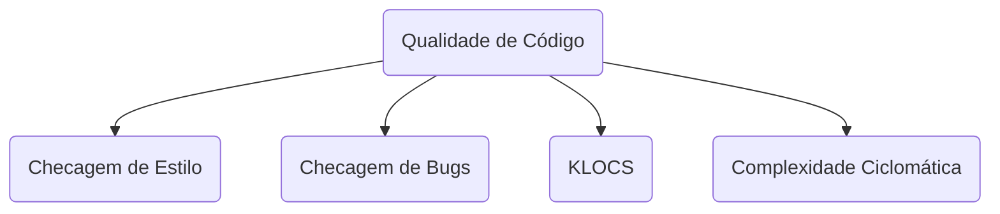

# DevQA: Como medir qualidade de código?

No [post](https://kamillaqueiroz.medium.com/devqa-como-medir-qualidade-de-c%C3%B3digo-6149fada1e) da Kamilla Queiroz, o assunto da vez foi métricas pra qualidade de código. Medir código não é uma tarefa completamente trivial, pois mesmo sendo uma camada específica do software existem diversos níveis aos quais a qualidade do software pode ser medida, se é que os indicadores usados para fazer essas medidas realmente são adequados.

Ao longo do artigo são cobertos vários tópicos diferentes para medição de qualidade de código.

Um dos primeiros tocantes do artigo são as verificações automáticas, que instantaneamente me lembrou do IntelliJ IDEA, provavelmente a opção mais adequada de IDE para desenvolvimento Java no momento. São feitas múltiplas verificações de qualidade de código em todos os arquivos do projeto, buscando por statements redudantes, retornos de variáveis que sempre possuem o mesmo valor, entre outros.

Além disso ela mencionou algumas ferramentas próprias pra medição dessas métricas em um código-fonte. A que mais me chamou atenção foi o SonarQube, que eu inclusive não tinha ciência de ser open source.

Aproveitando o tópico de ferramentas específicas para métrica, a autora citou algumas dicas para a aplicação dessas ferramentas na prática, incluindo regular as métricas para exibir apenas as que forem de fato relevantes para o projeto e incluir automação para rodar essa ferramenta na integração contínua, fazendo a medição dessas métricas para cada alteração que for realizada no software.
